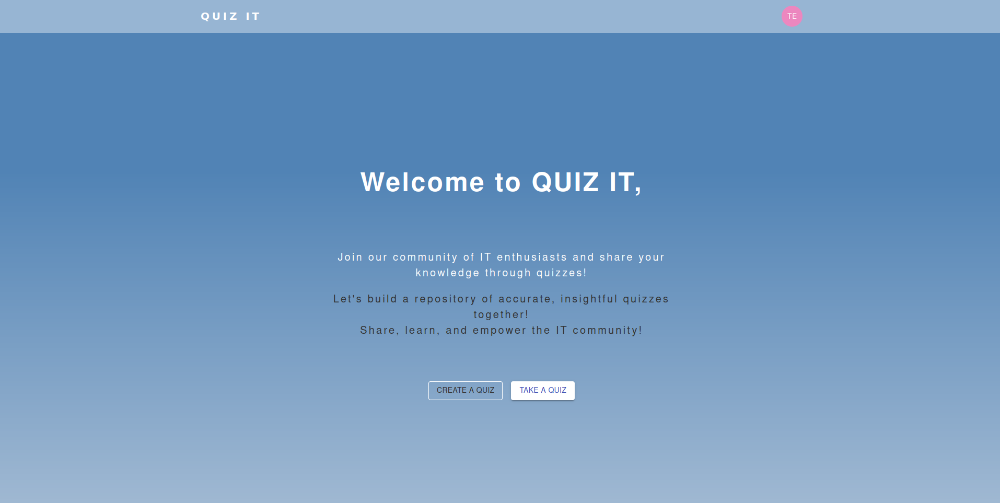

# Quiz It

## Description

Quiz It is an online quiz maker **Single Page Application**. It is designed to gather IT professionals and enthusiasts to participate in quizzes related to various IT concepts. Whether you're looking to test your knowledge or contribute by creating quizzes.

## Features

- **Take Quizzes**: Browse quizzes covering diverse IT topics.
- **Engaging Experience**: Enjoy a user-friendly and interactive interface.
- **Create Quizzes**: Contribute to the platform by creating your own quizzes for others to enjoy.
- **Feedback and Grading**: Receive immediate feedback and grading at the end of each quiz, ensuring accurate understanding of the concepts.
- **Learning**: Test your knowledge, learn new concepts, and have fun while doing it.

## Purpose

The primary goal of Quiz It is to create a vibrant and collaborative platform for IT professionals and enthusiasts to engage with quizzes.Often, false information can mislead developers, leading to misconceptions that persist until discovered.

## Notice

Please refer to the `frontend/README.md` and `backend/README.md` files for detailed instructions on setting up and running the frontend and backend of Quiz it.

### Tasks

- Home Page: Welcome message and option to create or take a quiz.
- Quiz Creation: Form to create a new quiz with questions and multiple-choice options.
- Quiz Taking: Display quiz questions one at a time with options for users to select answers.
- Quiz Results: Show the final score and correct answers after completing the quiz.
- Quiz Listing: Display a list of available quizzes for users to browse and take.
- User Authentication: Enable user registration and login for personalized experiences.
- Mobile Responsiveness: Ensure the quiz maker works well on different devices.
